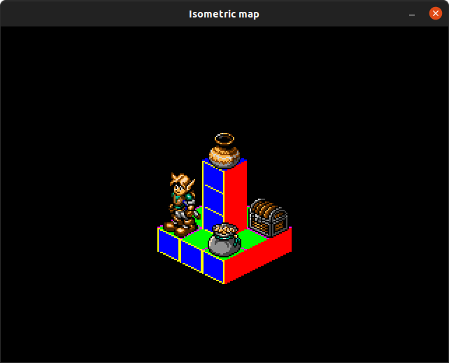

# Dependencies 

* pygame
* pygame_gui
* pyganim

```
pip3 install pygame pygame_gui pyganim
```

# Run 

* Game 
```
python3 main.py 
```

* Game without on screen debug

```
python3 -O main.py 
```

* Editor

```
python3 editor.py
```

# Screenshot

